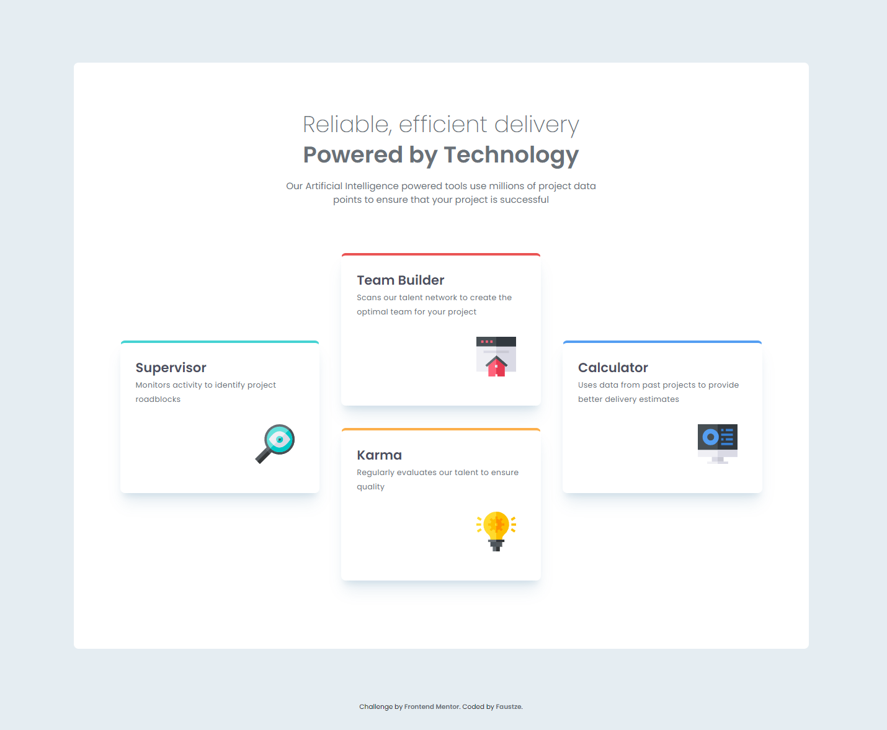

# Frontend Mentor - Four card feature section solution

This is a solution to the [Four card feature section challenge on Frontend Mentor](https://www.frontendmentor.io/challenges/four-card-feature-section-weK1eFYK). Frontend Mentor challenges help you improve your coding skills by building realistic projects.

## Table of contents

- [Overview](#overview)
  - [The challenge](#the-challenge)
  - [Screenshot](#screenshot)
  - [Links](#links)
- [My process](#my-process)
  - [Built with](#built-with)
  - [What I learned](#what-i-learned)
  - [Continued development](#continued-development)
  - [Useful resources](#useful-resources)
- [Author](#author)

## Overview

### The challenge

Users should be able to:

- View the optimal layout for the site depending on their device's screen size

### Screenshot



### Links

- Solution URL: [GitHub](https://github.com/Faustze/four_card_feature_section)
- Live Site URL: [GitHub Pages](https://faustze.github.io/four_card_feature_section)

## My process

### Built with

- Semantic HTML5 markup
- CSS custom properties
- Flexbox
- CSS Grid
- Mobile-first workflow

### What I learned

During this project, I learned several important CSS concepts:

**CSS Grid for layout:**

```css
.main__cards {
  display: grid;
  grid-template-columns: 1fr 1fr 1fr;
  grid-template-areas:
    "a b d"
    ". c .";
}
```

**Using CSS custom properties for dynamic styling:**

```html
<article class="main__card" style="--card-color: var(--cyan)"></article>
```

```css
.main__card {
  border-top: 0.3em solid var(--card-color);
}
```

**Understanding `:nth-child()` vs `:nth-of-type()`:**

- `:nth-child()` counts all children regardless of type
- `:nth-of-type()` counts only elements of the specified type
- Nested containers can break the expected order

**Combining Flexbox and Grid:**

- Grid for overall page layout
- Flexbox for aligning items within containers
- Both can be used together effectively

### Continued development

I want to continue improving my understanding of:

- Advanced CSS Grid techniques (nested grids, subgrid)
- More complex responsive layouts
- CSS architecture and naming conventions (BEM)
- Accessibility best practices

### Useful resources

- [CSS-Tricks: A Complete Guide to Grid](https://css-tricks.com/snippets/css/complete-guide-grid/) - Excellent visual guide to CSS Grid
- [MDN Web Docs: CSS Grid Layout](https://developer.mozilla.org/en-US/docs/Web/CSS/CSS_Grid_Layout) - Comprehensive documentation
- [CSS-Tricks: A Complete Guide to Flexbox](https://css-tricks.com/snippets/css/complete-guide-flexbox/) - Great Flexbox reference

## Author

- Frontend Mentor - [@Faustze](https://www.frontendmentor.io/profile/Faustze)
- GitHub - [Faustze](https://github.com/Faustze)
